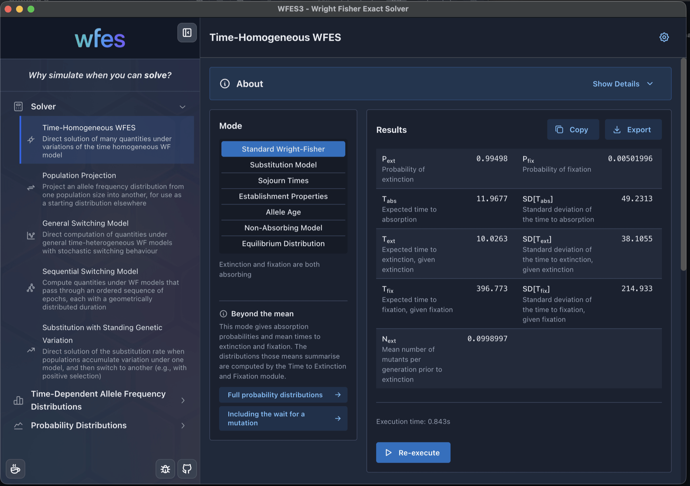
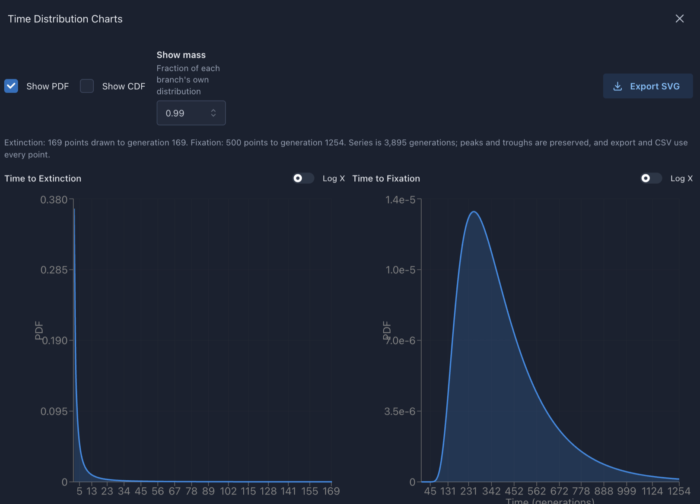

<p align="center">
  
</p>

<h1 align="center">WFES3 — Wright-Fisher Exact Solver</h1>

<p align="center"><em>Why simulate when you can solve?</em></p>

<p align="center"><strong>Initial beta release</strong></p>

WFES computes exact quantities under Wright-Fisher models of population
genetics: fixation and absorption probabilities, sojourn and absorption times
together with their full distributions, allele age, establishment, and allele
frequency spectra. It obtains them by solving sparse linear systems over the
complete transition matrix, so it needs neither simulation nor diffusion
approximation. Because the chain is solved directly, the classical
simplifying assumptions are not required: the calculations remain exact when
infinite sites, weak mutation, weak selection, or small per-generation
changes in allele frequency cannot be assumed. The extinction and
fixation boundaries, where diffusion approximations are least accurate, are
represented exactly.

This repository contains the C++ core library, eleven command-line programs
built on it, and an Electron application that provides a graphical interface
to those programs.

<p align="center">
  
</p>

<p align="center">
  
</p>

## Status

This is an initial beta release.

- The command-line programs are confirmed working on macOS (Apple Silicon)
  and on Linux. The Linux build, which uses Intel MKL and PARDISO, passes the
  full numerical validation suite and agrees with the macOS results to
  approximately 13 significant figures.
- The Electron application is confirmed on macOS.
- Windows support is planned. The build system carries the necessary
  scaffolding, but it has not yet been tested.

## Core Contributors

- Ivan Krukov (lead on WFES and WFES2)
- Bianca De Sanctis
- Alberto Casas Ortiz
- [A.P. Jason de Koning](mailto:jdekonin@ucalgary.ca)

## What's New (WFES3 beta)

- Support for macOS and Apple Silicon. WFES2 required Intel MKL, which no longer works on current Apple hardware.
- A factory-pattern backend that supports several computational linear
  algebra libraries, including MKL/PARDISO, Apple Accelerate, SuiteSparse
  UMFPACK, SuiteSparse ParU, and ViennaCL. The backend is chosen at run time
  with `--library`.
- A complete Electron-based graphical interface, designed to help the user
  access the computations and features that are available. It covers every
  program and adds live command-line previews, model-structure diagrams,
  per-program documentation, and charting.
- Bug fixes throughout, supported by a numerical validation suite of 54
  checks against independently computed reference values, together with
  automated tests of the graphical interface.

## What's New (WFES2)

These features were introduced in WFES2 and are carried forward into WFES3.
They extend the original release described in Krukov et al. (2017).

- Support for time-heterogeneous Wright-Fisher models through
  Markov-modulated Wright-Fisher extensions.
- Two routes to allele frequency distributions. The first applies iterative
  sparse matrix-vector products over deterministic epochs, allowing model
  parameters and population sizes to change between epochs. The second solves
  sparse linear systems directly for transient allele frequency
  distributions, under multi-epoch models with stochastic switching between
  regimes.
- Time-heterogeneous, multi-epoch models for the rate of substitution and
  related quantities under standing genetic variation.
- Full probability distributions for absorption times and other quantities,
  and direct solution of arbitrarily high moments of the time between
  fixations / the rate of substitution.

## Programs

| Program | Computes |
| --- | --- |
| `wfes_single` | Absorption probabilities, conditional and unconditional times, sojourn times, equilibrium frequencies, establishment, and exact moments of allele age, under a model whose parameters do not change |
| `wfes_switching` | The same absorption quantities under a Markov-modulated model, in which several Wright-Fisher regimes are visited according to a switching matrix |
| `wfes_sequential` | Absorption quantities for an ordered sequence of epochs, each with its own parameters and a geometrically distributed duration |
| `wfes_sweep` | The rate of substitution when adaptation draws on standing genetic variation, using a two-regime model |
| `time_dist` | Full probability distributions of the time to extinction and the time to fixation |
| `time_dist_dual` | The same distributions starting from zero copies, so that the wait for the mutation to arise is included |
| `time_dist_sgv` | The distribution of the time to substitution under standing genetic variation |
| `phase_type_dist` | The distribution of the time between successive fixations |
| `phase_type_moments` | Exact moments of that same time, to arbitrary order, without computing the distribution itself |
| `wfafs_deterministic` | Allele frequency spectra through a demographic history whose epoch lengths are exact |
| `wfafs_stochastic` | Allele frequency spectra when epoch durations are geometrically distributed, solved as a single linear system |

Every program accepts `--json` for machine-readable output at 17 significant
digits, `--csv`, `--initial` for a user-supplied starting distribution, and
`--help`. The programs share one flag vocabulary, so a parameter carries the
same name and the same meaning wherever it appears.

Two names differ from WFES2. Its `wfafle` corresponds to
`wfafs_deterministic` and `wfafs_stochastic` here, and
`doc/WFES_MODE_NAMING_MAP.md` maps the remaining mode names.

## Building

### Command-line programs on macOS

The build requires Homebrew LLVM, libomp, and suite-sparse, and it pins the
Homebrew toolchain.

```bash
brew install llvm libomp suite-sparse
cmake -S wfes-cli -B wfes-cli/build
cmake --build wfes-cli/build -j8
```

### Command-line programs on Linux, using Intel MKL and PARDISO

Please use the script rather than invoking cmake directly. It checks the
prerequisites, requires an explicit choice of MKL threading layer, and
validates the numerical results instead of trusting a clean compile.

```bash
./wfes-cli/build_linux.sh
```

The `--threading gnu|intel|sequential` option selects the MKL threading
layer, and defaults to `gnu`, which pairs with the libgomp that GCC links.
Combining MKL's `intel_thread` layer with `-fopenmp` under GCC loads two
OpenMP runtimes into one process, which is unsupported, so the script fails
the build if `ldd` shows that, or if the LP64 rather than the ILP64 MKL
interface was linked. The resulting binaries link the GCC runtime statically
and therefore run without the build toolchain on the path.

### Graphical interface

The application spawns the command-line programs as child processes, so
please build those first. During development it finds them at
`wfes-cli/build/bin`, and a packaged application finds them among its own
resources.

```bash
cd wfes-ui/wfes2-electron
npm install
npm run dev        # development
npm run dist:mac   # packaged and signed, macOS
```

## Validation

The `baseline_tests/` directory holds the evidence that the numbers are
right. Its expected values come from independent dense reference computations
built from the underlying mathematics rather than from WFES output, so the
suite can detect an error that has been present from the beginning.

```bash
python3 baseline_tests/validate_baselines.py
```

The 54 checks cover absorption, fixation, equilibrium, establishment, sojourn
behaviour, and the moments of allele age. Agreement is required to half an
ulp of the coarser of the printed and the recorded value. We suggest running
the suite after any change to the library or the programs. The `--bin` and
`--library` options point it at a different binary or backend.

## Solver backends

The file `wfes-cli/include/backend_config.h` selects a backend at compile
time, and `--library` selects one at run time. On macOS the default is
`Accelerate`, which names the matrix backend only: matrices are held in
Accelerate format, while the LU factorizations and the solves are performed
by SuiteSparse's UMFPACK. Apple's own sparse solver is used only as a
fallback, when a build does not link SuiteSparse. On Linux the default is MKL
with PARDISO. The `ParU` option selects SuiteSparse's parallel LU
factorization. ViennaCL requires OpenCL support, which the released binaries
do not include.

## Documentation

| Location | Contents |
| --- | --- |
| `about/*.md` | Documentation for each program, also shown inside the application |
| `doc/manual-wfes2.md` | The WFES2 manual, subject to the naming notes above |
| `doc/WFES_MODE_NAMING_MAP.md` | How WFES2 and WFES3 program and mode names correspond |

## Citing

If you use WFES in published work, please cite:

- Krukov I, de Sanctis B, de Koning APJ (2017). Wright-Fisher exact solver
  (WFES): scalable analysis of population genetic models without simulation
  or diffusion theory. *Bioinformatics* 33(9):1416-1417.
  doi:[10.1093/bioinformatics/btw802](https://doi.org/10.1093/bioinformatics/btw802)

For the exact computation of allele age, please cite:

- De Sanctis B, Krukov I, de Koning APJ (2017). Allele age under
  non-classical assumptions is clarified by an exact computational Markov
  chain approach. *Scientific Reports* 7.
  doi:[10.1038/s41598-017-12239-0](https://doi.org/10.1038/s41598-017-12239-0)

## License

WFES3 is released under the GPL-3.0 license. Third-party license texts and
attributions are collected in `third-party licenses/`. The principal
dependencies are Intel MKL on Linux, the Apple Accelerate system framework on
macOS, SuiteSparse, Eigen, ViennaCL, Boost, and the Electron, React, and
Mantine stack.
